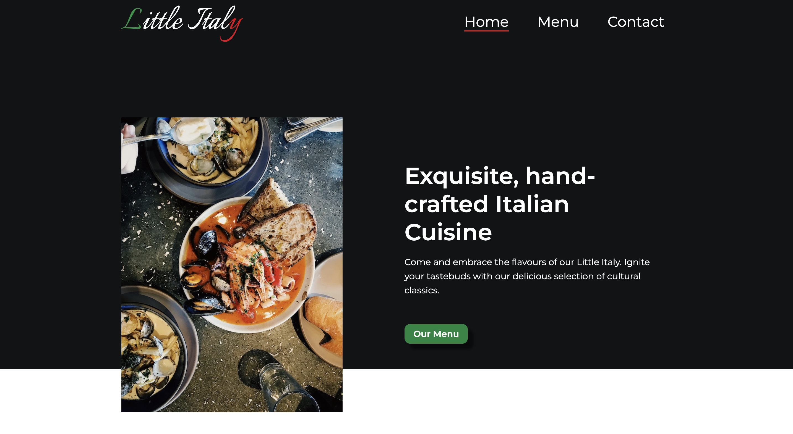
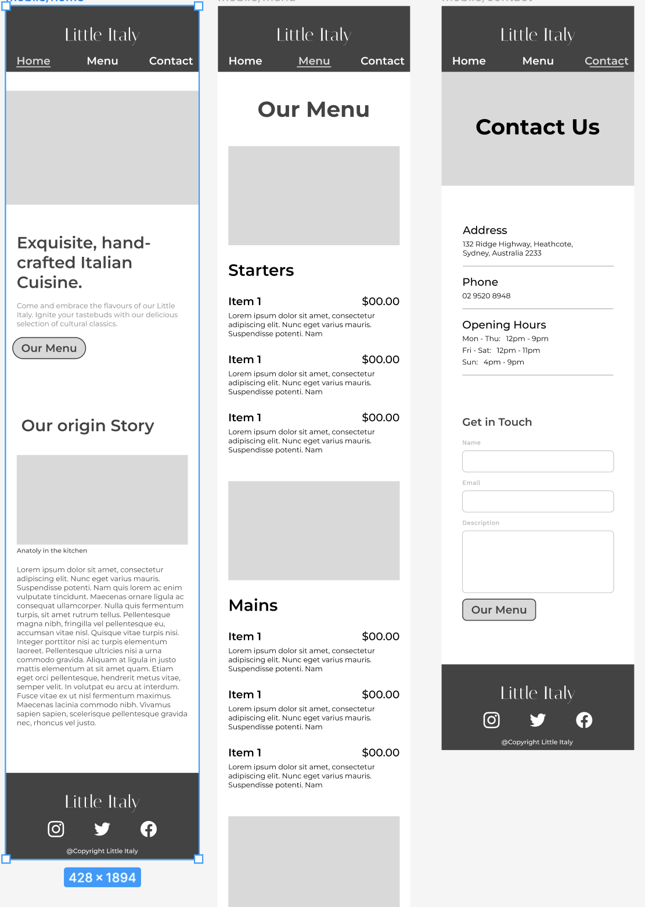
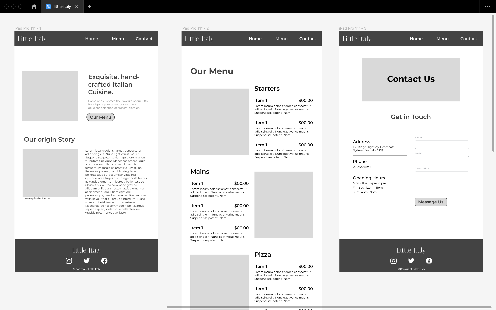

# restaurant-page
A simple small business webpage for an Italian restaurant.

## Table of contents
* [Technologies](#general-info)
* [Academic Goals](#technologies)
* [WireFrames](#setup)

## Technologies
* HTML
* CSS
* Javascript
* Webpack

## Academic Goals
From an Academic standpoint, each project I build is used as a vehicle to learn. In this project, 
it was the first time I have encorporated webpack, and implemeneted javascript modules. This was my main academic goal.
It was also the first time I have used Figma to design high fidelity wireframes, they are shown below.

## WireFrames

